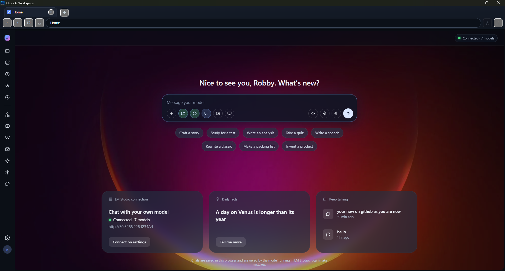
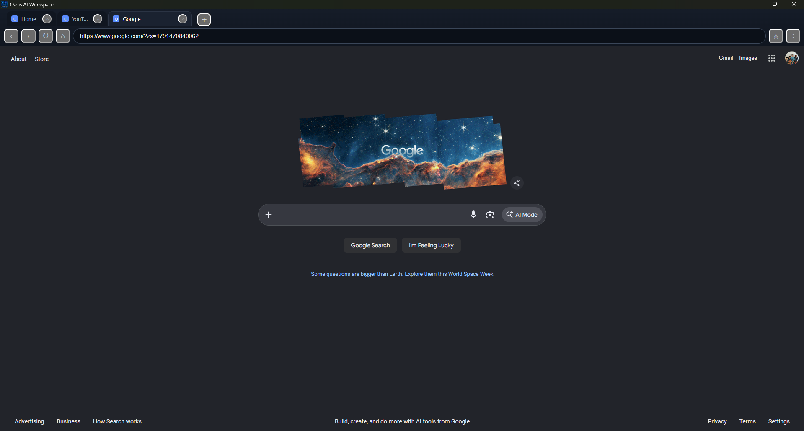
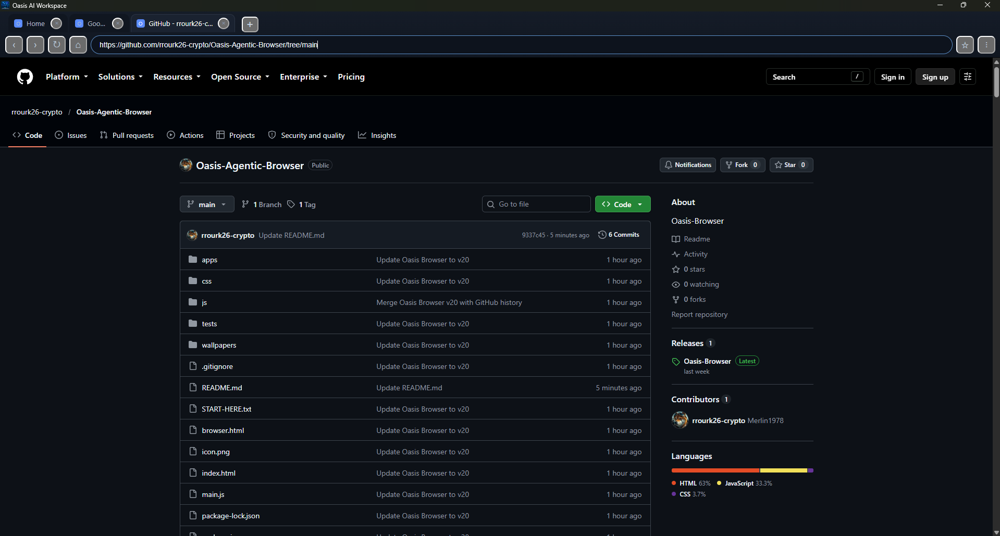
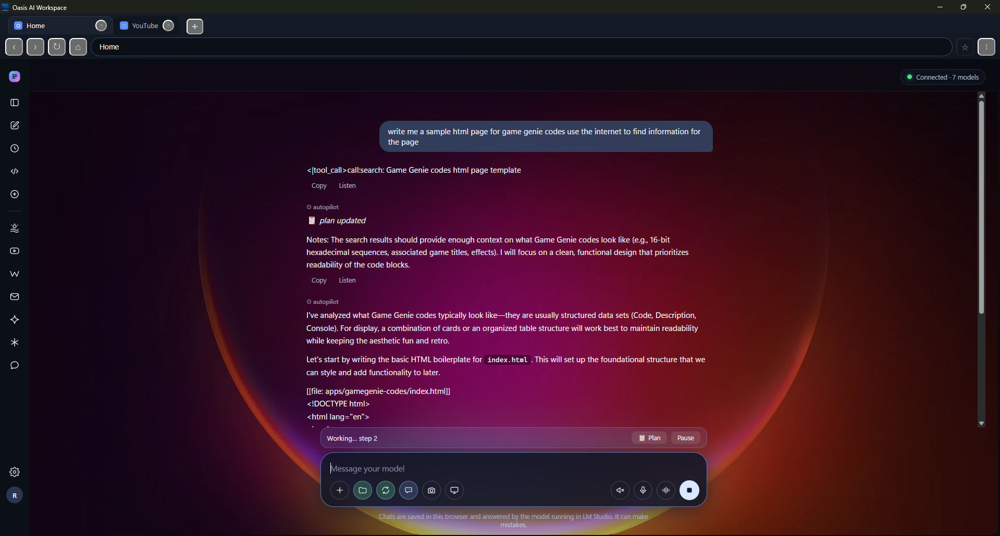
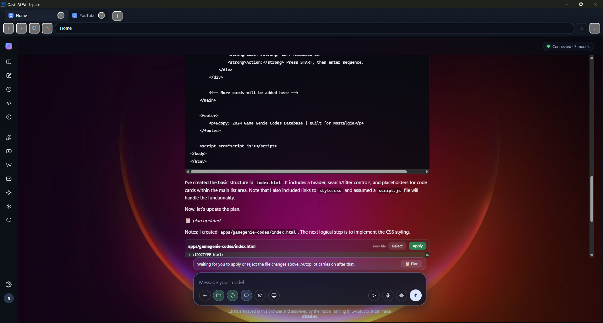
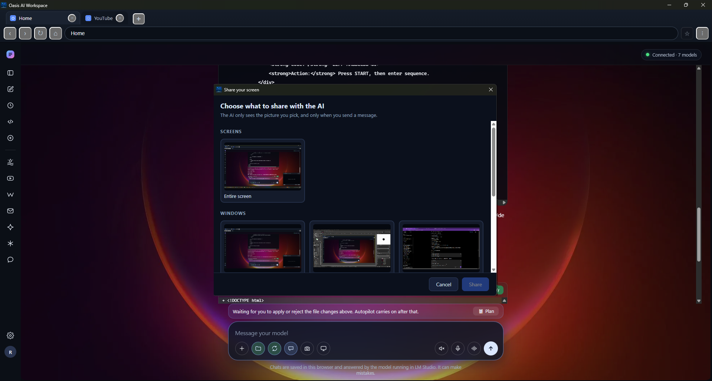

# 🌐 Oasis Agentic Browser

**Oasis Agentic Browser** is an open-source, local-first AI browser and Windows desktop workspace built around **agentic AI, local models, automation, and direct access to your computer**.

> **Formerly known as Oasis Browser**

**Oasis Agentic Browser** is an open-source, local-first browser and desktop workspace for Windows.

Oasis is designed to bring web browsing, local AI, Windows tools, applications, files, media, communication, games, and personal projects together in one place.

It is built with **Electron**, while also allowing local web applications and tools to operate inside the Oasis environment.

The goal is simple:

> **Give people a workspace they can actually make their own.**

---

## 📸 Screenshots

### Oasis Agentic Browser



### Web Browsing





### Projects & Files


### Agentic Tools





### Screen Sharing



---

# ✨ What Is Oasis?

Oasis is more than a traditional web browser.

It can act as a central workspace for your computer, combining:

* Web browsing
* Local AI
* Windows commands
* PowerShell
* Command Prompt
* Windows application launching
* Local HTML applications
* Games
* File management
* ZIP files
* Shared workspace projects
* Screen sharing
* Webcam access
* Media
* Messaging
* Developer tools
* Personal utilities

Instead of treating every capability as a separate application, Oasis brings them together into one environment.

---

# 🪟 Windows Integration

Oasis can interact with Windows through **PowerShell and Command Prompt (CMD)**.

This allows users and applications to work with normal Windows commands and utilities.

Examples include:

```text
ipconfig
ping
tracert
nslookup
tasklist
taskkill
systeminfo
hostname
whoami
netstat
dir
cd
mkdir
copy
move
del
ren
start
where
tree
```

Oasis can also launch Windows applications and utilities.

This allows an Oasis-based application to open or interact with programs already installed on the user's computer rather than being limited to ordinary web pages.

Examples can include Windows utilities, development tools, media applications, file tools, and other installed programs.

---

# 🤖 Local AI

Oasis is designed to work with **locally hosted AI**.

The local AI system has been **tested and successfully connected using LM Studio** through its OpenAI-compatible API.

The tested local API endpoint is:

```text
http://localhost:1234/v1
```

This allows Oasis to communicate with AI models running directly on the user's own computer.

## ✅ Tested Local Models

Oasis has been tested with local models running through LM Studio, including:

* **Gemma 4**
* **Qwen**

The Qwen model configuration has also been tested through the local LM Studio API.

The specific model can be changed inside the local AI server without requiring Oasis itself to be rebuilt.

## 🔌 OpenAI-Compatible API

Oasis also includes an **OpenAI-compatible API connection**.

This connection has been tested and works with the local LM Studio server.

The important part is that Oasis does not require the AI server itself to be OpenAI's cloud service.

A compatible local server can provide the same API-style interface while the actual model runs on the user's own computer.

For example:

```text
Oasis
  ↓
OpenAI-compatible API
  ↓
LM Studio
  ↓
Gemma 4 / Qwen / other local model
  ↓
Your computer
```

This makes it possible to use Oasis with local AI without sending every AI request to a paid cloud provider.

## 🎛️ AI Freedom

The goal is to give users freedom over:

* Which model they use
* Where the model runs
* Which AI server they connect to
* Which local AI tools they use
* Their own AI applications
* Their model configuration
* Their computer hardware

Oasis is not intended to lock users into one AI provider or one model.

If a compatible local AI server can provide the required API interface, it can potentially be used with Oasis.

---

# 📁 Shared Workspace

Oasis can use a shared **`workspace`** folder for projects and files.

The workspace can contain practically anything the user wants to work with, including:

* HTML applications
* JavaScript
* CSS
* Images
* Documents
* Games
* AI projects
* Utilities
* Development projects
* ZIP files
* Personal files
* Experimental applications

The idea is that the workspace becomes a common place where Oasis applications and user projects can work together.

**Your workspace is yours.**

---

# 📦 ZIP Files

Oasis supports working with ZIP files and project archives.

ZIP files can be uploaded or imported into the workspace so projects and collections of files can be moved around without requiring a separate application for every basic operation.

This also makes it easier to share projects between users.

---

# 📷 Webcam and Media Access

Oasis can provide access to browser-supported hardware and media capabilities when the user grants permission.

This can include:

* Webcam
* Microphone
* Camera
* Screen capture
* Screen sharing
* Other supported media devices

Applications running inside Oasis can use these capabilities when appropriate permissions are granted.

---

# 🖥️ Screen Sharing

Oasis can support screen-sharing functionality through Electron and browser media APIs.

This can allow applications to work with:

* Desktop screens
* Application windows
* Browser windows
* Screen capture
* Remote collaboration tools
* Streaming and communication applications

Permissions remain under the user's control.

---

# 🌐 Web + Local Applications

Oasis can combine ordinary websites with local applications.

A project can contain its own HTML, CSS, JavaScript, images, games, tools, or other resources and run them inside Oasis.

This makes it possible to build small applications without requiring every project to become a completely separate Windows program.

Examples include:

* Games
* Dashboards
* AI interfaces
* Utilities
* Media players
* Productivity tools
* Experimental applications
* Personal websites
* Developer tools

---

# 🎮 Games and Experimental Projects

Oasis can also serve as a home for games and experimental applications.

Projects can be added to the workspace and launched from within Oasis.

The goal is not to restrict Oasis to one particular type of application.

If it can be built as a compatible web or local application, it can potentially become part of an Oasis workspace.

---

# 🛠️ Built With Electron

Oasis is built using **Electron**.

Electron allows Oasis to combine web technologies with native desktop capabilities.

The project can therefore use technologies such as:

* HTML
* CSS
* JavaScript
* Node.js
* Electron APIs
* Windows commands
* Local files
* Local services
* Web APIs

This makes Oasis both a browser environment and a Windows desktop application.

---

# 🚀 Building Oasis

Anyone can download the source code, modify it, and build their own version.

## Requirements

You will need:

* Windows 10 or Windows 11
* Node.js
* npm
* Git is recommended

---

## 📥 Install Dependencies

Clone or download the repository and open PowerShell in the Oasis project directory.

Then run:

```powershell
npm install
```

This installs the project's required Node.js and Electron dependencies.

---

# ▶️ Run Oasis From Source

To run Oasis directly from the source code:

```powershell
npm start
```

This launches the Electron application without creating a standalone installer.

This is useful when developing or testing changes.

---

# 🧪 Development Workflow

A basic development workflow is:

```powershell
npm install
npm start
```

Modify the source code, save your changes, and test the application.

You can then build your updated version for Windows.

---

# 🏗️ Build the Windows Version

Oasis can be packaged as a Windows Electron application.

Run:

```powershell
npm run build:win
```

The Electron builder configuration in `package.json` determines the exact Windows output.

The generated Windows installer and packaged application are normally placed in:

```text
dist
```

The exact filenames can change between releases.

---

# 📦 Creating Your Own Oasis Build

Because Oasis is open source, you can create your own customized build.

You can change things such as:

* Application name
* Icon
* User interface
* Colors
* Applications
* Browser behavior
* AI configuration
* Windows integration
* Workspace behavior
* Games
* Tools
* Navigation
* Settings
* File handling
* Built-in services

Then build your customized version:

```powershell
npm run build:win
```

You can distribute your own version according to the terms of the project's license.

---

# 🔀 Fork Oasis

You are encouraged to fork Oasis.

You can:

* Fork the repository
* Change the source
* Rename it
* Replace the interface
* Add applications
* Remove applications
* Add new Windows features
* Add your own AI system
* Create your own workspace
* Build your own version
* Share your modifications
* Create something completely different from the original

Your fork does not have to remain identical to Oasis.

Oasis is intended to be a foundation that people can build on.

---

# 🔐 Planned Password Manager

A future version of Oasis is planned to include a **built-in password manager**.

The goal is to eventually allow users to securely manage passwords and other credentials directly inside Oasis instead of requiring a completely separate password-management application.

The password manager is a **planned feature** and is **not included in the current release**.

Security will be an important consideration when this feature is implemented.

---

# 🔮 Future Development

Oasis is an evolving project.

Possible future features include:

* Built-in password manager
* More Windows integration
* Additional Windows application controls
* More local AI capabilities
* Additional productivity tools
* Expanded file-management features
* More communication tools
* More games
* Additional media capabilities
* Improved workspace management
* More local services
* Additional developer tools
* Greater customization

The project is intentionally open-ended.

---

# 🌱 Project Philosophy

Oasis is built around a simple idea:

> **Your computer should belong to you.**

Your files should be accessible.

Your applications should be customizable.

Your AI should be able to run locally.

Your workspace should be yours.

And the software itself should be something you can inspect, modify, rebuild, and share.

Oasis is an experiment in putting those ideas together into one environment.

---

# 🔓 Open Source

Oasis is open source.

You are free to take the project in your own direction.

You can:

**Fork it.**

**Change it.**

**Rename it.**

**Rebuild it.**

**Add to it.**

**Remove things from it.**

**Create something completely different from it.**

The purpose of open source is not simply to let people look at the code.

It is to let people **use the code as a starting point for their own ideas.**

---

# 🤝 Community

Oasis is intended to be a community-driven project.

If you build something with Oasis, you can share it.

If you improve Oasis, you can contribute those improvements.

If you want to take the project in a completely different direction, you can create your own fork.

There is no requirement for every Oasis-based project to look or behave the same way.

---

# 📜 License

Oasis Agentic Browser is released under the **MIT License**.

You are free to use, modify, fork, rename, and redistribute the project according to the terms of the MIT License.

See the `LICENSE` file for the complete license text.

---

# ♿ Accessibility

Use:

```text
Control + Shift + M
```

to toggle tab-key navigation.

Alternatively:

```text
Esc
Tab
```

can be used to move to the next interactive element on the page.

---
## 💬 Community & Support

Want to talk about **Oasis Agentic Browser**, ask questions, get help, share ideas, report problems, or just hang out with other people interested in the project?

Join the **Oasis Agentic Browser** group on **Oasis Social**:

### 🌐 [Oasis Agentic Browser - The Oasis](https://oasis.myguyinthechair.com/s/oasis-agentic-browser/)

**Oasis Social** is the community and social side of the Oasis project. It's a place for more than just technical support. You can:

* 💬 Talk about Oasis and what you're building with it
* 🛠️ Ask for help and troubleshoot problems
* 💡 Suggest features and share ideas
* 🐛 Discuss bugs and issues
* 📸 Share screenshots, projects, and experiments
* 🤖 Talk about local AI, agents, LM Studio, and automation
* 🌐 Discuss the future of the Oasis Agentic Browser
* 👥 Meet and talk with other Oasis users
* 🗣️ Or just hang out and talk

GitHub is where the code lives. **Oasis Social is where the people are.**

Come join the community and help shape where Oasis goes next.


# 🌐 Project

**Oasis Agentic Browser**

An open-source Windows workspace built with Electron.

Browse.

Build.

Create.

Experiment.

Make it yours.
